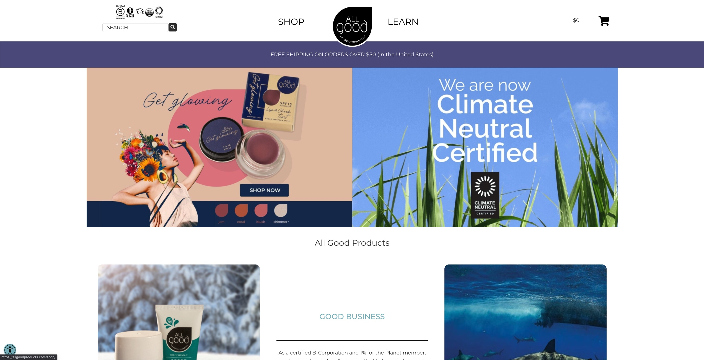

Hi!

I'm Charlie. I work with a variety of clients to make software that helps their business.

I mostly write software for the web.

# Here's what I've been working on recently

1. [allgoodproducts.com](https://allgoodproducts.com)

2. [juncha.com](https://juncha.com)

# Hire me

If you'd like to chat, send me an email at charles.hebert@incremental-it.com

## What particular skills do I have?

1. Fundamental web technologies (HTML, JavaScript, CSS)
2. Animation (using both CSS and [gsap](https://greensock.com/gsap/))
3. WordPress
