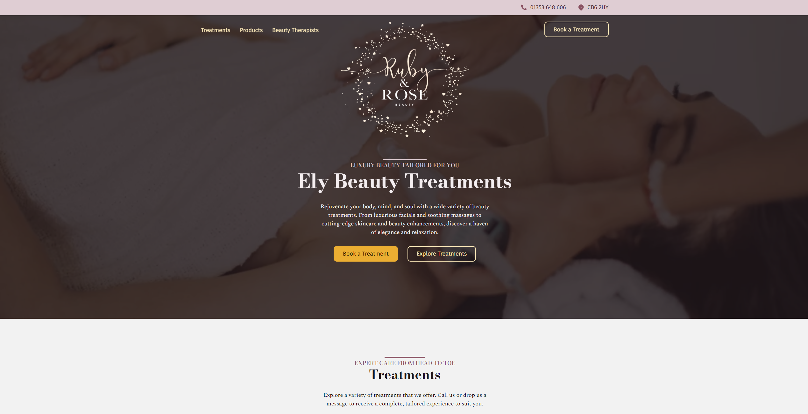

# Hi, I'm Charlie! 👋

I'm a **Software Engineer**. Ex SpotX, AWS, and ShutterStock. With over 8 years of experience building software for clients and businesses, I'm now exploring the fascinating world of **low-level programming**, **game engines**, and **real-time systems**.

---

## 🎮 Here's Some Stuff I've Worked On

### [Snake Game](https://github.com/chooie/sdl3_opengl_snake_game)
A cross-platform Snake game built with **C++** and **SDL3**. This is my playground for learning real-time graphics rendering with OpenGL, responsive input handling, and sound integration in native applications.

### [Hack Assembler](https://github.com/chooie/hack_assembler)
A symbolic-to-binary assembler for the Hack machine language. Through this project, I'm delving deeper into machine-level programming, bitwise operations, and file parsing.

### Freelance Web Projects

#### [rubyandrosebeauty.co.uk](https://rubyandrosebeauty.co.uk)
Designed and built a responsive WordPress website for a UK-based beauty salon, focusing on user-friendly navigation and modern aesthetics.

#### [juncha.com](https://juncha.com)
Created an interactive portfolio with smooth animations to showcase the artist's work. Added features for appointment management to streamline client interactions.

#### [allgoodbodycare.com](https://allgoodbodycare.com)
Developed a high-conversion ecommerce platform for a body care company, optimizing for mobile users and seamless checkout processes.

---

## 🛠 My Skill Set

- **Programming Languages:** C, C++, JavaScript, PHP
- **Game Development Tools:** SDL3, OpenGL
- **Web Technologies:** HTML, CSS, WordPress, Shopify
- **Other Tools:** Docker, Git

---

## 📫 Let's Connect

- Email: charlie[at]incremental-it.com
- LinkedIn: [linkedin.com/in/hebertc](https://linkedin.com/in/hebertc)

I'm always open to chatting about programming, game development, or collaborating on cool projects. Feel free to reach out!